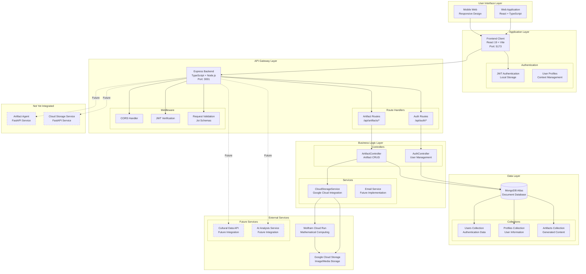
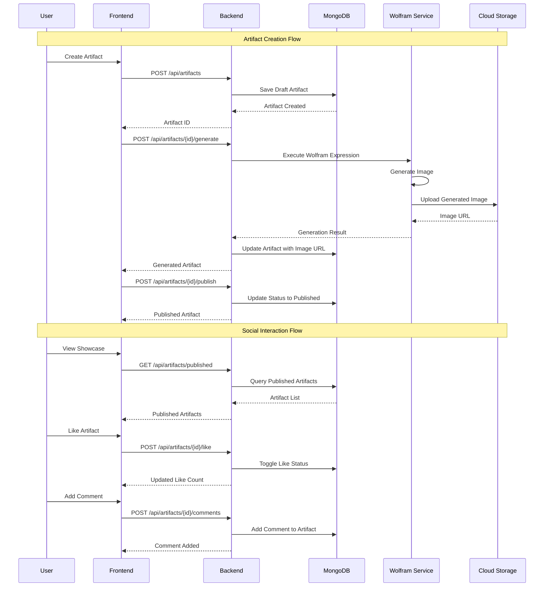
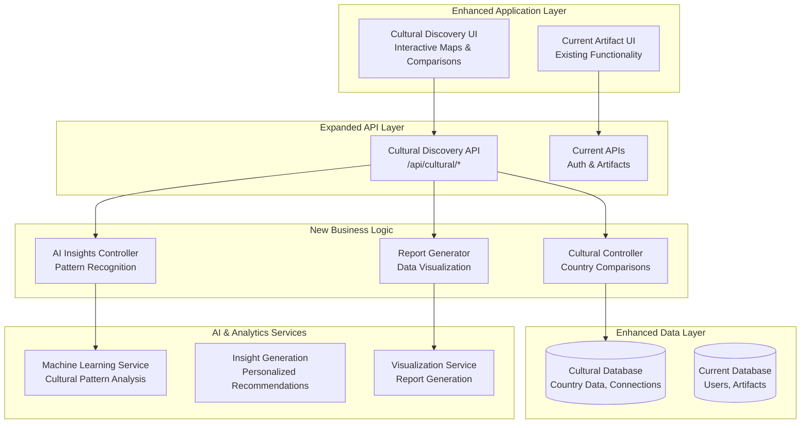
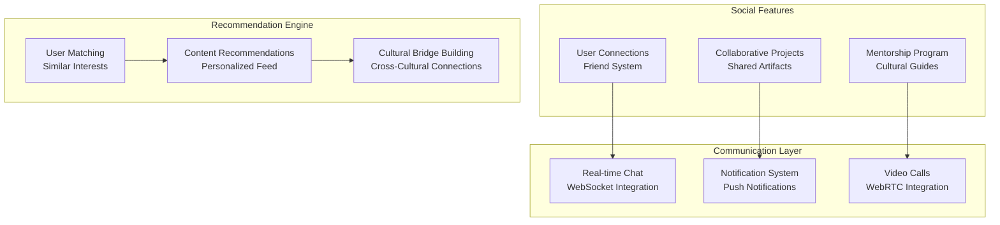
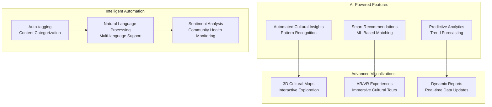

# Unity Hub Architecture Documentation

## 🏗️ System Architecture Overview

Unity Hub is designed as a scalable, microservices-based platform that facilitates creative expression through mathematical art generation and community interaction. The architecture supports both current functionality and future expansion into cultural discovery and global networking.

## 🎯 Current Architecture (v1.0.0)

### System Components



### Data Flow Architecture



## 📊 Current Database Schema

### MongoDB Collections

```javascript
// Users Collection
{
  _id: ObjectId,
  email: String,
  passwordHash: String,
  createdAt: Date,
  updatedAt: Date
}

// Profiles Collection  
{
  _id: ObjectId,
  userId: ObjectId,
  displayName: String,
  bio: String,
  avatarUrl: String,
  country: String,
  interests: [String],
  createdAt: Date,
  updatedAt: Date
}

// Artifacts Collection
{
  _id: ObjectId,
  artifactId: String, // Unique identifier
  userId: ObjectId,
  title: String,
  expression: String, // Wolfram Language code
  imageUrl: String,
  format: String, // 'png' | 'gif'
  status: String, // 'draft' | 'published'
  likes: [ObjectId], // User IDs who liked
  comments: [{
    _id: ObjectId,
    userId: ObjectId,
    userName: String,
    comment: String,
    createdAt: Date
  }],
  tags: [String],
  createdAt: Date,
  updatedAt: Date,
  publishedAt: Date
}
```

## 🔮 Future Architecture Evolution

### Phase 2: Cultural Discovery Integration



### Phase 3: Global Network & Collaboration



### Phase 4: Advanced AI Integration



## 🔧 Technology Evolution Plan

### Current Tech Stack (v1.0.0)
- **Frontend**: React 19, TypeScript, Vite, Tailwind CSS
- **Backend**: Express.js, Node.js, TypeScript
- **Database**: MongoDB Atlas
- **Cloud**: Google Cloud Storage, Cloud Run
- **Authentication**: JWT, bcrypt

### Planned Additions

#### Phase 2 Technologies
- **AI/ML**: TensorFlow.js, Python ML services
- **Data Processing**: Apache Spark, Pandas
- **Visualization**: D3.js, Chart.js, Three.js
- **Cultural Data**: REST Countries API, World Bank API

#### Phase 3 Technologies  
- **Real-time**: Socket.io, WebRTC
- **Search**: Elasticsearch, Algolia
- **Caching**: Redis, CDN integration
- **Mobile**: React Native (future mobile apps)

#### Phase 4 Technologies
- **Advanced AI**: OpenAI GPT integration, Custom ML models
- **3D/AR/VR**: WebGL, A-Frame, React 360
- **Analytics**: Apache Kafka, Tableau integration
- **Microservices**: Docker, Kubernetes, Service Mesh

## 🔐 Security Architecture

### Current Security Measures
- JWT token authentication
- bcrypt password hashing
- CORS protection
- Input validation (Joi schemas)
- HTTPS enforcement
- Environment variable protection

### Future Security Enhancements
- OAuth 2.0 / Social login integration
- Role-based access control (RBAC)
- API rate limiting
- Content moderation AI
- Privacy-compliant data handling
- End-to-end encryption for messages

## 📈 Scalability Considerations

### Current Scalability Features
- Cloud-native architecture
- Stateless API design
- Document database (MongoDB)
- CDN-ready static assets
- Microservice-ready structure

### Future Scalability Plans
- Horizontal API scaling
- Database sharding strategies
- Caching layer implementation
- Load balancer integration
- Container orchestration (Kubernetes)
- Multi-region deployment

---

This architecture document provides a roadmap for Unity Hub's evolution from a creative artifact platform to a comprehensive cultural discovery and global networking ecosystem.