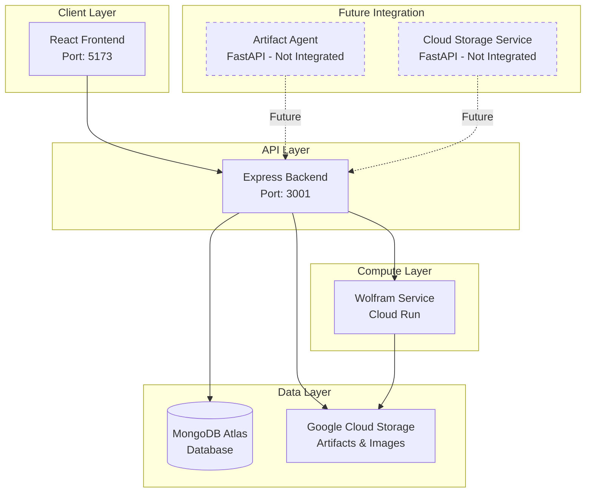

# Unity Hub - Artifact Generation & Community Platform

[](./RELEASE_NOTES.md)
[](./LICENSE)
[]()

**Unity Hub** is a creative platform that enables users to generate stunning mathematical visualizations using Wolfram Language and share them with a global community. Built for the Hack4Unity hackathon, it focuses on bringing people together through creative expression and mathematical art.

## 🚀 Quick Start

```bash
# Clone the repository
git clone https://github.com/barada02/Hack4Unity.git
cd Hack4Unity

# Start backend (Terminal 1)
cd backend
npm install
npm run dev

# Start frontend (Terminal 2)  
cd frontend
npm install
npm run dev

# Access the application
# Frontend: http://localhost:5173
# Backend: http://localhost:3001
```

## 📋 Prerequisites

- **Node.js** >= 18.0.0
- **MongoDB Atlas** account (for database)
- **Google Cloud Storage** (for artifact storage)
- **Cloud Run** service (for Wolfram execution)

## 🏗️ Architecture Overview

Unity Hub follows a modern microservices architecture with the following components:



## 🎯 Current Features (v1.0.0)

### ✅ **Live Features**
- **User Authentication & Profiles** - JWT-based secure authentication
- **Wolfram Artifact Generation** - Create PNG/GIF visualizations
- **Community Showcase** - Browse and discover artifacts
- **Social Interactions** - Like and comment on artifacts
- **Real-time Publishing** - Instant artifact sharing
- **Cloud Storage Integration** - Scalable image storage
- **Responsive Design** - Mobile-first UI/UX

### 📊 **Technical Stack**
- **Frontend**: React 19, TypeScript, Vite, Tailwind CSS
- **Backend**: Node.js, Express, TypeScript, MongoDB
- **Cloud**: Google Cloud Storage, Cloud Run
- **Database**: MongoDB Atlas
- **Authentication**: JWT tokens, bcrypt

## 🔮 Future Roadmap

### 🚧 **Phase 2: Cultural Discovery**
- Cultural comparison engine
- AI-powered insights
- Interactive cultural maps
- Historical connections

### 🚧 **Phase 3: Global Network**
- User-to-user connections
- Collaborative projects
- Cultural exchange programs
- Mentorship matching

### 🚧 **Phase 4: AI Integration**
- Personalized recommendations
- Cultural insight generation
- Smart artifact categorization
- Predictive analytics

## 📁 Project Structure

```
Hack4Unity/
├── frontend/                 # React frontend application
├── backend/                  # Express.js API server
├── Artifact_Agent/           # FastAPI agent (future integration)
├── Cloud_Storage_service/    # Storage service (future integration)
├── Wolfram/                  # Wolfram Language scripts
├── docs/                     # Architecture & documentation
├── ARCHITECTURE.md           # Detailed architecture guide
├── RELEASE_NOTES.md         # Version history
└── README.md               # This file
```

## 🔧 Configuration

### Environment Variables

**Backend (.env)**
```env
PORT=3001
MONGODB_URI=mongodb+srv://...
JWT_SECRET=your-secret-key
CLOUD_RUN_URL=https://your-wolfram-service.run.app
GOOGLE_CLOUD_BUCKET=your-bucket-name
```

**Frontend (.env)**
```env
VITE_API_URL=http://localhost:3001
```

## 🧪 Testing

```bash
# Backend tests
cd backend
npm test

# Frontend tests  
cd frontend
npm test

# API endpoint tests
npm run test:endpoints
```

## 📚 Documentation

- [Architecture Guide](./ARCHITECTURE.md) - Detailed system design
- [API Documentation](./backend/README.md) - Backend API reference
- [Frontend Guide](./frontend/README.md) - React app documentation
- [Release Notes](./RELEASE_NOTES.md) - Version history

## 🤝 Contributing

1. Fork the repository
2. Create a feature branch (`git checkout -b feature/amazing-feature`)
3. Commit your changes (`git commit -m 'Add amazing feature'`)
4. Push to the branch (`git push origin feature/amazing-feature`)
5. Open a Pull Request

## 📄 License

This project is licensed under the MIT License - see the [LICENSE](LICENSE) file for details.

## 🙏 Acknowledgments

- **Hack4Unity Hackathon** - For inspiring this cultural unity project
- **Wolfram Research** - For powerful mathematical computing capabilities
- **Google Cloud** - For reliable cloud infrastructure
- **MongoDB** - For flexible document database
- **Open Source Community** - For amazing tools and libraries

## 🆘 Support

- **Issues**: [GitHub Issues](https://github.com/barada02/Hack4Unity/issues)
- **Discussions**: [GitHub Discussions](https://github.com/barada02/Hack4Unity/discussions)
- **Email**: support@unityhub.dev

---

**Built with ❤️ for global unity and cultural understanding**